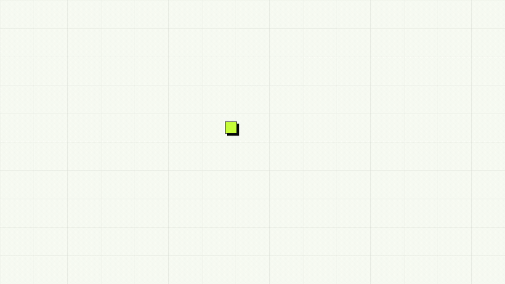

# Nitrograph

[](https://www.npmjs.com/package/nitrograph)
[](https://nodejs.org/)
[](LICENSE)



**Your agent needs a service. Nitrograph finds it, ranks it, and tells the agent how to call it.**

Nitrograph indexes agent-usable APIs across x402 and MPP, ranks them by task fit, health, trust, cost, and prior agent outcomes, then exposes the result through MCP, a TypeScript harness, and raw HTTP.

```bash
npm i -g nitrograph
```

## What Happens

1. Your agent describes what it needs in plain language.
2. Nitrograph returns ranked services with trust signals, pricing, health, and call details.
3. The agent inspects the selected service before invocation. You stay in control of spending.
4. The outcome feeds the trust graph. Every reported transaction makes future search smarter.

## Quick Start

### Option 1: With an AI Agent

Install the Nitrograph skill, then talk to your agent normally:

```bash
npx skills add nitrographtech/cli
```

Example prompts:

> Find me a lead generation API and show me the best options with pricing.

> Find an image generation service under $0.05 per call.

> Find a data enrichment service, show me how to call the top result, then run it.

The skill teaches your agent the full workflow: search for services, compare options, treat `results` as high-confidence recommendations, treat `related_results` as lower-confidence fallbacks, inspect before calling, and report what worked.

### Option 1b: Codex Plugin

Nitrograph is packaged as a Codex plugin with:

- `skills/nitrograph/SKILL.md` for the agent workflow.
- `.mcp.json` for the hosted Nitrograph MCP server at `https://api.nitrograph.com/mcp`.
- `.codex-plugin/plugin.json` with install-surface metadata for the Codex plugin directory.

Install it in Codex today by adding the Nitrograph repo marketplace:

```bash
codex plugin marketplace add nitrographtech/cli --sparse .agents/plugins
codex plugin marketplace upgrade nitrograph-plugins
```

Restart Codex, open the plugin directory, select **Nitrograph Plugins**, and install **Nitrograph**. The plugin adds the Nitrograph skill plus the hosted MCP server configuration.

If the marketplace is already installed, refresh it with:

```bash
codex plugin marketplace upgrade nitrograph-plugins
```

### Option 2: Hosted MCP

Register Nitrograph as a remote MCP server, no local install needed:

```text
https://api.nitrograph.com/mcp
```

Use this when your MCP client supports remote HTTP servers.

MCP discover calls should send complete filter state every time. Use `"any"` for unset filters so MCP hosts do not accidentally retain stale nested filter values:

```json
{
  "query": "lead generation",
  "limit": 10,
  "filters": {
    "rail": "any",
    "max_cost": "any",
    "min_trust": "any",
    "category": "any"
  }
}
```

### Option 3: Local MCP

```bash
npx nitrograph
```

The wizard detects installed MCP clients and writes a stdio server entry into each config file, creating `.bak` backups first. If stdin is not a TTY, it runs hands-off and installs into every detected client.

### Option 4: TypeScript

```ts
import { Nitrograph } from 'nitrograph';

const ng = new Nitrograph();

const { results, related_results } = await ng.discover('lead generation', {
  limit: 10,
});

const filtered = await ng.discover('lead generation', {
  limit: 10,
  category: 'lead_generation',
  rail: 'any',
  max_cost: 'any',
  min_trust: 'any',
});

const best = results[0];
const detail = await ng.serviceDetail(best.slug);

await ng.reportOutcome({
  slug: best.slug,
  success: true,
  endpoint: '/v1/people/search',
  latencyMs: 350,
});
```

## Why Nitrograph

**Agents find services by guessing. That does not scale.** Today, agents browse documentation, hardcode endpoints, and hope for the best. Nitrograph gives them a task-aware discovery layer.

**Rankings come from behavior, not marketing.** Agents can report outcomes after service calls, giving future searches better signals about uptime, latency, success rate, cost accuracy, and integration gotchas.

**Discovery and execution fit in one flow.** Search returns ranked results. Service detail returns endpoints, schemas, costs, health, gotchas, and patterns that worked for other agents.

**You control spending.** Nitrograph shows options with real pricing before the agent invokes a service.

## MCP Tools

| Tool | Purpose |
|---|---|
| `nitrograph_discover` | Search by task in plain language. Returns ranked `results` and lower-confidence `related_results`. |
| `nitrograph_service_detail` | Fetch endpoints, schemas, costs, health, gotchas, and proven call patterns for a specific service. |
| `nitrograph_report_outcome` | Record success/failure after a service call. Feeds trust rankings and gotcha promotion. |
| `nitrograph_report_pattern` | Record a reusable multi-step workflow that worked. |

## Harness API

```ts
new Nitrograph({
  apiUrl: 'https://api.nitrograph.com',
  sessionToken: process.env.NITROGRAPH_SESSION_TOKEN,
  timeoutMs: 15_000,
  userAgent: 'my-agent/1.0',
});
```

Errors extend `NitrographError`:

- `NitrographApiError`: non-2xx response.
- `NitrographPaymentRequiredError`: free tier exhausted; includes `payAt`.
- `NitrographNetworkError`: timeout or connection failure.

## Raw HTTP

```bash
curl -sX POST https://api.nitrograph.com/v1/discover \
  -H 'content-type: application/json' \
  -d '{"query":"lead generation","limit":10}'
```

Raw HTTP filters are optional, but when provided they belong under `filters`:

```bash
curl -sX POST https://api.nitrograph.com/v1/discover \
  -H 'content-type: application/json' \
  -d '{"query":"lead generation","limit":10,"filters":{"category":"lead_generation"}}'
```

```bash
curl -s https://api.nitrograph.com/v1/service/apollo
```

## Skills And Plugins

Nitrograph ships an agent skill at:

```text
skills/nitrograph/SKILL.md
```

Install from GitHub:

```bash
npx skills add nitrographtech/cli
```

The repository also includes `.codex-plugin/plugin.json` so the same skill surface can be used by Codex plugin workflows as that ecosystem stabilizes.

## Config

`~/.config/nitrograph/config.json`:

```json
{
  "api_url": "https://api.nitrograph.com"
}
```

The free tier requires no config and no API key. When the free tier is exhausted, Nitrograph returns a pay-to-continue URL; the returned session token can be passed as `NITROGRAPH_SESSION_TOKEN`.

## Links

- Website: <https://nitrograph.com>
- Docs: <https://nitrograph.com/docs>
- Agent docs: <https://nitrograph.com/llms-full.txt>
- npm: <https://www.npmjs.com/package/nitrograph>
- Issues: <https://github.com/nitrographtech/cli/issues>

## License

MIT
